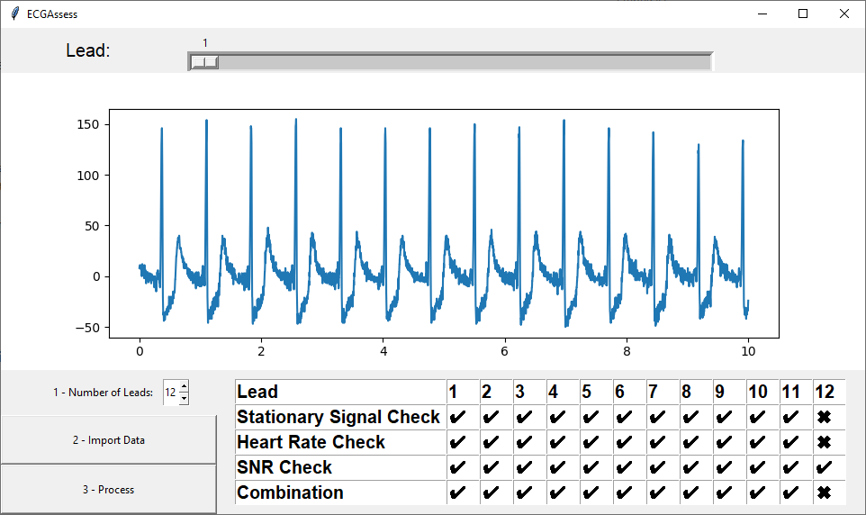

# ECGAssess: A Python-Based Toolbox For ECG Lead Signal Quality Assessment

	

The program is available twice. To get the results of the algorithms, the main file must be used. 
In this file, the algorithm automatically compares the results of the algorithms with the 
annotations of the files and indicates the number of true positives, true negatives, false negatives
and false positives.

The user interface with the algorithms is available in the files GUI and algorithms. 
Here only the GUI file must be executed.
