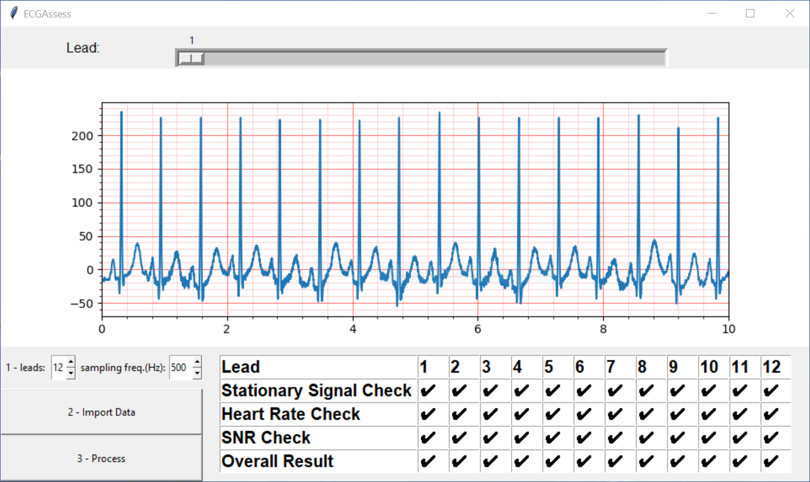

# ECGAssess: A Python-based Toolbox to Assess ECG Leads

## Executable File

### Prerequisites - Program
The executable program should work on all operating systems and does not require any installation or additional software.

### Prerequisites - Data

The data entered in program must have the same formatting as the data in the folder "set-a". Specifically this means:

* The document must be in .txt, .csv, .xls, .xlsx or wfdb format.
* There is no heading or any other written words in the document.
* Each measurement is written on a new line.
* In the first column is the numeration of the measurements.
* The other columns are the measured values of the ECG machine in microvolts.
* The individual columns are separated from each other according to the data type.

***Example (with 12 leads):***
>**0**,0,4,4,-2,4,-2,0,-4,-16,-16,-16,-12\
>**1**,2,4,2,-3,3,0,-2,-6,-16,-18,-16,-14\
>**2**,0,4,4,-2,4,-2,-2,-6,-15,-18,-16,-14\
>**3**,-2,6,8,-2,7,-5,-2,-6,-15,-18,-15,-11\
>**4**,-3,6,9,-1,8,-6,0,-4,-14,-16,-15,-11\
>...\
>**4997**,-4,-12,-8,8,-10,2,16,12,-6,-15,-12,-12\
>**4998**,-3,-12,-9,7,-10,3,16,12,-4,-14,-12,-12\
>**4999**,0,-12,-12,6,-12,6,16,12,-4,-12,-12,-12

### GUI

After starting the program, a window is opened, which is built up as shown in the image above. To use the program, simply follow the numbers:

1. The first thing to be done is to set how many leads the ECG to be evaluated has. The number can be set simply by clicking the arrow buttons. The default value is 12 and it can be selected from the range of 1 to 12 leads. Then the frequency, in Hz, at which the measurements were made must be entered. The default sampling frequency is 500 Hz.
2. Next, the "Load Data" button must be pressed. A new window opens where a file must be selected. This file must contain the correct leads as set in step 1 and must meet the data requirements described above.
4. The last thing to do is to press the "Process" button. After that, the results of the analysis will be visible in the table at the bottom right.

After a file is loaded into the program, the plot is visible in the center of the window. The visible lead can be adjusted with the slider at the top of the window.

## Annotation

In the annotation folder are all the data with which the classification of the signals was made. The classification of the signals was made with the plots in the powerpoint files. The powerpoint files are sorted by data set (testing / training) and by groups (I / II).  The result of the annotation can be seen in the Excel files.

## Code

In the code folder are the source codes of the executable program. This code is divided into a GUI file and an Algorithms file. The GUI file refers to the Algorithm file and therefore only the Gui file must be executed.

## Lists

There is a separate readme file in the Lists folder.

## Set-a

In this dataset are all signals provided by the Physionet/Computing in Cardiology Challenge 2011. The development of the algorithms was made exclusively with these data. All 998 ECG recordings consist of 12 leads, have a length of 10 seconds and a measurement frequency of 500 Hz.
